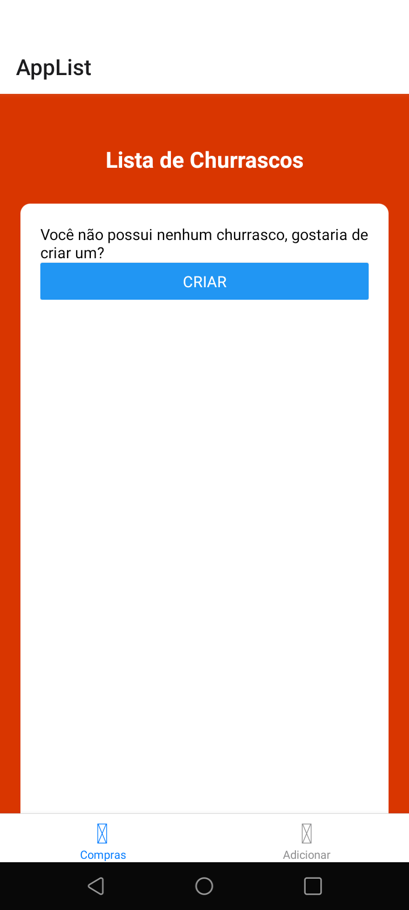
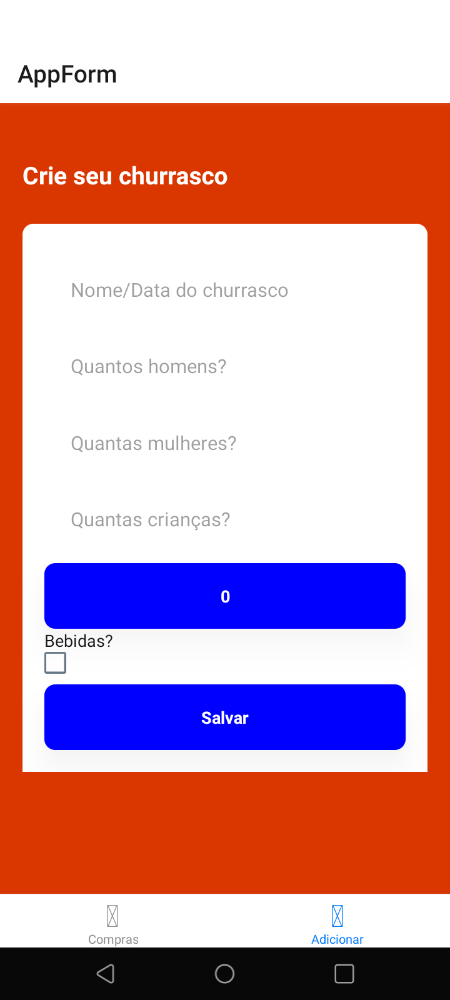
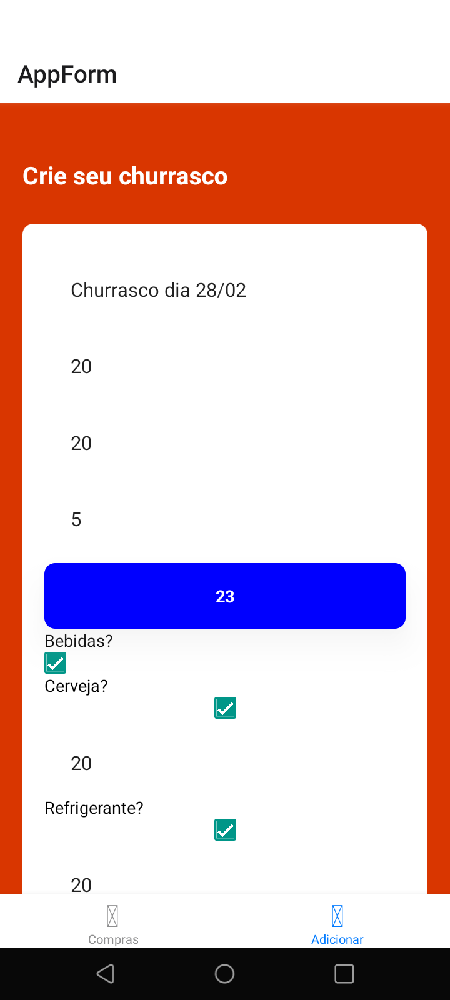
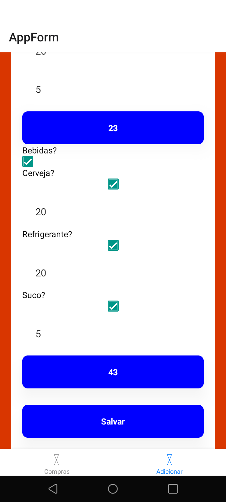
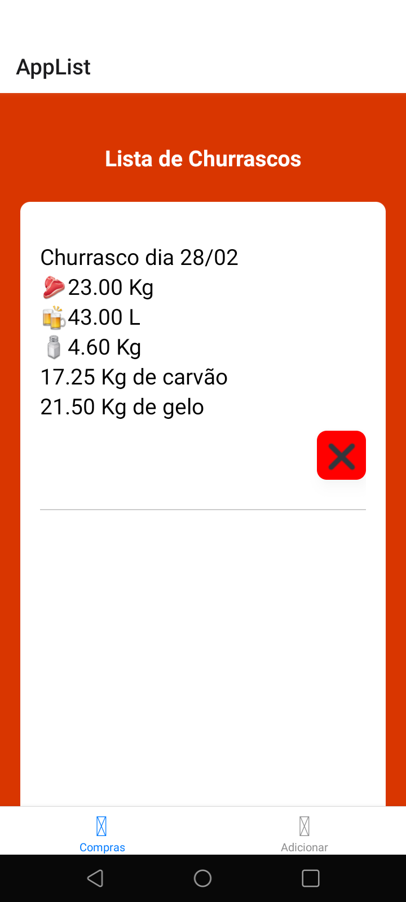
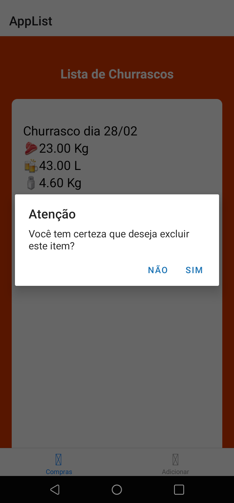

<p align="center">
<h1>Churras App</h1> 

</p>

> Aplicação para auxiliar a criação de um churrasco

Projeto feito com React Native que salva os dados informados pelo cliente em Async Storage, ou seja, não apresenta um banco de dados como MySQL ou MongoDB por exemplo

---

## Tecnologias

O Churras App faz uso de:

* ![Expo][expo]
* ![Expo-Cli][expo-cli]
* ![Expo-Status-Bar][expo-status-bar]
* ![React-Native][react-native]
* ![React-Navigation][react-navigation]
* ![Async-Storage][async-storage]

## Instalação

Clone o projeto em uma pasta de sua escolha
```
git clone https://github.com/goldmansenai/Churras-App
```

Acesse a pasta do projeto clonado e em seguida instale as dependências
```
cd Churras-App && yarn install <ou npm install>
```

Rode o projeto com expo start, ou yarn/npm start
```
expo start
```

## Demo
<p>
AppList:
</p>

<p>
AppForm:
</p>

<p>
Conteúdo em AppList:
</p>



<p>
Deletar conteúdo:
</p>



## Autores

* *Pedro Andrade*
* *Síntia Tháfeny*
* *Victor Gomes*
* *Vinicius Nascimento*
* *Vinícius Sanches*


<!-- Imagens e Badges -->
[expo]: https://img.shields.io/badge/Expo-44.0.0-blue?style=for-the-badge
[expo-cli]: https://img.shields.io/badge/Expo_CLI-%5E5.1.2-blue?style=for-the-badge
[expo-status-bar]: https://img.shields.io/badge/Expo_Status_Bar-~1.2.0-blue?style=for-the-badge
[react-native]: https://img.shields.io/badge/React_Native-~0.64.3-blue?style=for-the-badge
[react-navigation]: https://img.shields.io/badge/React_Navigation-~6.x-blue?style=for-the-badge
[async-storage]: https://img.shields.io/badge/Async_Storage-~1.15.0-blue?style=for-the-badge
